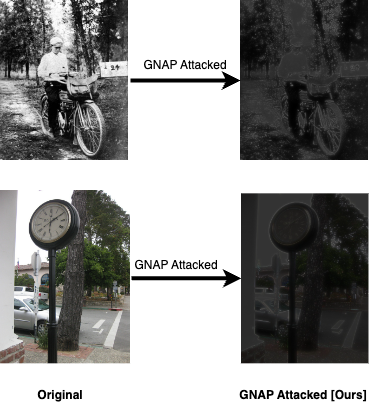

# GNAP

Code for *"GNAPing On the Job: Attacking and Defending Facial Detection on Edge Devices"* (Accepted in IEEE SoutheastCon 2025)

<p align='center'>
  
</p>

## Introduction

The **GNAP Attack and GNAG Defense** repository implements and evaluates advanced adversarial attacks and defenses for facial detection systems on resource-constrained edge devices. It provides the code for the **Guided inspired Noise Attack Pyramid (GNAP)**, a novel adversarial attack designed to degrade facial recognition accuracy, and the **Guided Noise Attack Guard (GNAG)**, a defense strategy that restores system robustness. Both techniques are tailored for real-world adversarial scenarios on edge devices, focusing on maintaining high performance and security under constrained computational resources. This repository accompanies the research paper *"GNAPing On the Job: Attacking and Defending Facial Detection on Edge Devices"* (Accepted in IEEE SoutheastCon 2025).

## Prerequisites

To get started, you’ll need the following dependencies installed:

- Python 3.6+
- TensorFlow or PyTorch (depending on your model)
- OpenCV
- NumPy

You can install the dependencies using the following command:

```bash
pip install -r requirements.txt
```
## Dataset
To reproduce the experiments from the paper, you can use the Labeled Faces in the Wild (LFW) dataset.

## GNAP Attack
attack_images.py: This script applies the GNAP attack on a set of still 

images. You can specify the input directory containing images to attack.

Example usage:

```bash
python attack_images.py --input_dir /path/to/images --output_dir /path/to/save
```
attack_lfw.py: Performs both attack and defense on the LFW dataset. Outputs include the modified images and calculated confidence scores.

Example usage:

```bash
python attack_lfw.py --lfw_dir /path/to/lfw --output_dir /path/to/save
```
image_attacker.py: Uses a YOLO model to calculate confidence scores after applying the attack.

laplace_fps.py: This script runs a real-time attack on video input, measuring FPS and attack impact.

## GNAG Defense
defend_image.py: Apply the GNAG defense on images that have already been attacked. This can be used to restore the image quality and accuracy of the model.

Example usage:

```bash
python defend_image.py --input_dir /path/to/attacked_images --output_dir /path/to/save
```
clean_image.py: Adjusts the defense dynamically for clean images.

## Result 
The table below shows that the GNAP Model reduces the system’s confidence from 0.99 to 0.82 under attack. After applying the (name of defense) defense, confidence is restored to 0.98, demonstrating the defense’s effectiveness in mitigating the attack's impact.

# Attack and Defense Effectiveness on LFW Dataset (Caffe)
| Attack Status           | Mean Highest Confidence |
|-------------------------|-------------------------|
| Original                | 0.99                    |
| LoG [1]                 | 0.97                    |
| Laplacian Pyramid       | 0.99                    |
| GNAP Model Attack [Ours]| 0.82                    |
| GNAG Defense [Ours]     | 0.98                    |

## Q&A
Questions are welcome via asolanki42@tntech.edu

## License
This project is licensed under the MIT License - see the LICENSE file for details.
