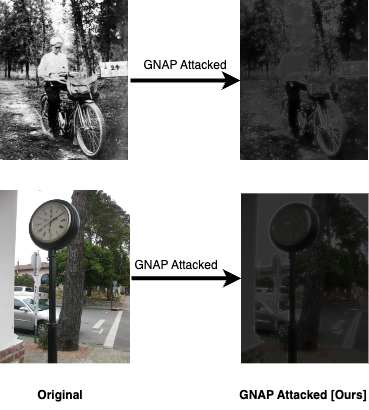

# GNAP

Code for *"GNAPing On the Job: Attacking and Defending Facial Detection on Edge Devices"* (Published in IEEE SoutheastCon 2025) (Presented at the SoutheastCon 2025 Conference by Abhijeet Solanki)

📄 **Paper**: [IEEE Xplore (DOI: 10.1109/SoutheastCon56624.2025.10971676)](https://doi.org/10.1109/SoutheastCon56624.2025.10971676)

<p align='center'>
  
</p>

## Introduction

The **GNAP Attack and GNAG Defense** repository implements and evaluates advanced adversarial attacks and defenses for facial detection systems on resource-constrained edge devices. It provides the code for the **Guided inspired Noise Attack Pyramid (GNAP)**, a novel adversarial attack designed to degrade facial recognition accuracy, and the **Guided Noise Attack Guard (GNAG)**, a defense strategy that restores system robustness. Both techniques are tailored for real-world adversarial scenarios on edge devices, focusing on maintaining high performance and security under constrained computational resources. This repository accompanies the research paper *"GNAPing On the Job: Attacking and Defending Facial Detection on Edge Devices"* (Accepted in IEEE SoutheastCon 2025).

## Prerequisites

To get started, you’ll need the following dependencies installed:

- Python 3.9+
- NumPy and Matplotlib
- OpenCV with the contrib modules (the attack and defense use `cv2.ximgproc.guidedFilter`)
- PyTorch, for `image_attacker.py` (it loads YOLOv5 through `torch.hub`)
- OpenCV's ResNet-10 SSD face detector (`deploy.prototxt.txt` and `res10_300x300_ssd_iter_140000.caffemodel`), for the scripts that measure face-detection confidence

You can install the Python dependencies using the following command:

```bash
pip install numpy matplotlib opencv-contrib-python torch
```

Each script reads its input folder, image or model paths from variables set in the file (marked "Update this"). Point them at your copies before running it.
## Dataset
To reproduce the experiments from the paper, you can use the Labeled Faces in the Wild (LFW) dataset.

## GNAP Attack
`attack/attack_images.py`: applies the GNAP attack to a folder of still images.

```bash
python attack/attack_images.py
```
`attack/attack_lfw.py`: performs both attack and defense on the LFW dataset. Outputs include the modified images and calculated confidence scores.

```bash
python attack/attack_lfw.py
```
`attack/image_attacker.py`: uses a YOLOv5 model to calculate confidence scores after applying the attack.

`attack/laplace_fps.py`: runs a real-time attack on webcam video, measuring FPS and attack impact.

## GNAG Defense
`defense/defend_image.py`: applies the GNAG defense to an image that has already been attacked, restoring image quality and the model's accuracy.

```bash
python defense/defend_image.py
```
`defense/clean_image.py`: adjusts the defense dynamically for clean images.

## Result 
The table below shows that the GNAP Model reduces the system’s confidence from 0.99 to 0.82 under attack. After applying the GNAG defense, confidence is restored to 0.98, demonstrating the defense’s effectiveness in mitigating the attack's impact.

# Attack and Defense Effectiveness on LFW Dataset (Caffe)
| Attack Status           | Mean Highest Confidence |
|-------------------------|-------------------------|
| Original                | 0.99                    |
| LoG [1]                 | 0.97                    |
| Laplacian Pyramid       | 0.99                    |
| GNAP Model Attack [Ours]| 0.82                    |
| GNAG Defense [Ours]     | 0.98                    |

## Q&A
Questions are welcome via asolanki42@tntech.edu, ryan.thornton@lander.edu

## Acknowledgement
This research is partially supported by Qatar National
Research Foundation (NPRP14S-0413-210206), National Science Foundation (NSF-REU 2349104) and Faculty Research
Grant 2023-24 from the Office of Research at Tennessee Tech University, Tennessee Tech University’s Center for Manufacturing Research

## License
This project is licensed under the MIT License - see the LICENSE file for details.
